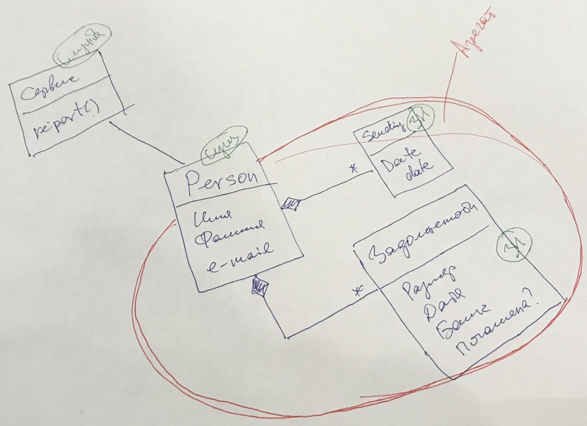

Министерство науки и высшего образования Российской Федерации  
Федеральное государственное бюджетное образовательное учреждение  
высшего образования  
Кубанский государственный аграрный университет  
им. И.Т. Трубилина

ФАКУЛЬТЕТ ПРИКЛАДНОЙ ИНФОРМАТИКИ  
КАФЕДРА ИНФОРМАЦИОННЫХ СИСТЕМ

 

ОТЧЕТ  
к лабораторной работе №2  
по дисциплине "Современные технологии разработки  
программного обеспечения"  
Реализация модели предметной области  
с использованием техники непрерывной интеграции

 

Преподаватель: Петров А.А.

Студент группы:

## Описание задания

Задача № 0: "Коллекторское агентство".

Задание: Необходимо сформировать отчёт для обзвона ещё не оповещённых должников. Отчёт должен содержать ФИО, общую задолженность и дату последнего оповещения.

## Адрес проекта

Проект хранится в удаленном репозитории по адресу: [https://github.com/anton-petrov/msdtm/labs/1](https://github.com/anton-petrov/msdtm/labs/2).

## Диаграммы классов

Диаграммы классов создаются автоматически при обновлении ветки `master` в удаленном репозитории GitHub и выкладываются в страницы проекта по адресу: [https://github.com/anton-petrov/msdtm/labs/2](https://github.com/anton-petrov/msdtm/labs/2).

## Модель предметной области

## Выводы

!!!!!!!!!!!
