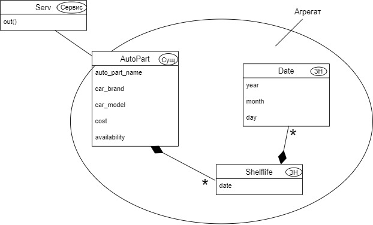
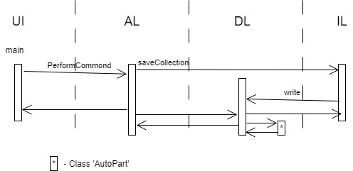

Министерство науки и высшего образования Российской Федерации  
Федеральное государственное бюджетное образовательное учреждение  
высшего образования  
Кубанский государственный аграрный университет  
им. И.Т. Трубилина

ФАКУЛЬТЕТ ПРИКЛАДНОЙ ИНФОРМАТИКИ  
КАФЕДРА ИНФОРМАЦИОННЫХ СИСТЕМ

 

ОТЧЕТ  
к лабораторной работе №3  
по дисциплине "Современные технологии разработки  
программного обеспечения"  
Реализация модели предметной области  
с использованием техники непрерывной интеграции

 

Преподаватель: Петров А.А.

Студент группы: ПИ2041 Коновалов С.В.

## Описание задания

Задача № 13: "Магазин автозапчастей".

## Адрес проекта

Проект хранится в удаленном репозитории по адресу: [https://github.com/KonovalovISergey/Lab2](https://github.com/KonovalovISergey/Lab2).

## Диаграммы классов

## Модель предметной области

## Выводы

Проект преобразован в простое DevOps приложение.

DevOps - методология активного взаимодействия специалистов по разработке со специалистами по информационно-технологическому обслуживанию и взаимная интеграция их рабочих процессов друг в друга для обеспечения качества продукта.
Приобретены навыки разработки простого DevOps приложения, работая в команде с использованием системы управления версиями Git и удаленного репозитория GitLab.